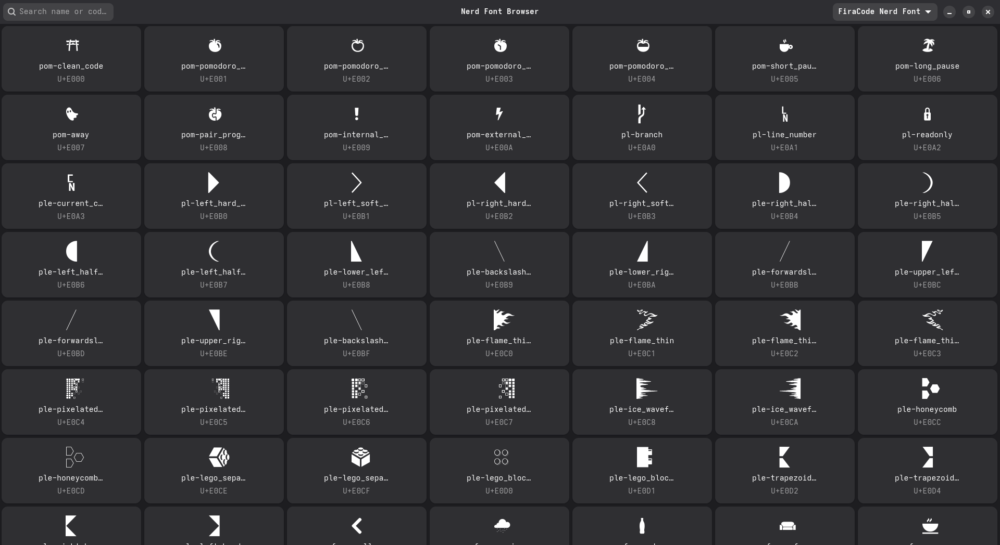

# Nerd Font Icon Browser (libadwaita + Python)

Quick, minimal icon browser for Nerd Fonts with click-to-copy.



---

## Requirements

- Python 3.10+
- GTK 4 + libadwaita (runtime)
- PyGObject (GObject introspection for Python)
- fontTools (`pip install fonttools`) to extract glyph names from the selected font
- Optional: fontconfig tools (`fc-match`, `fc-list`) for resolving font files

Install runtimes (examples):

- Debian/Ubuntu:
  - `sudo apt install python3-gi gir1.2-gtk-4.0 gir1.2-adw-1`
- Arch Linux:
  - `sudo pacman -S gtk4 libadwaita python python-gobject python-fonttools`

---

## Run

```bash
python3 app.py
```

---

## Architecture

- Entry point: `app.py`
- MVC package: `nerdicon_browser/`
  - Models: `models/` (icon data, font utilities)
  - Views: `views/` (GTK UI window and grid)
  - Controllers: `controllers/` (UI wiring, async scanning)

All GTK/Pango operations run on the main thread for stability with Wayland.

---

## Usage

* Select a font family from the dropdown (prefers Nerd Font families).
  The app scans the font’s Private Use Area (U+E000–U+F8FF) and shows all glyphs present.
* Type in the search box to filter by name or codepoint (e.g. `rocket` or `f135`).
* Click any tile to copy the glyph character to the clipboard.
  A toast confirms with glyph name (from the font, when available) and codepoint.

---

## Data

* The app reads the selected font directly to find all available Nerd Font glyphs in the BMP/SPUA ranges.
* It extracts glyph names via **fontTools**.
* If the font only contains generic names (e.g., `uniE0A0`), those will be shown.

---

## Font Note

* Ensure a Nerd Font is installed on your system (e.g. **Symbols Nerd Font**).
* Use the dropdown to pick the exact family to browse.

---

## Troubleshooting

- If glyphs appear as blanks/boxes, make sure a Nerd Font is installed and accessible to GTK.
- You may need to log out/in after installing fonts.
- Clipboard: On Wayland, the app uses native GTK clipboard APIs and verifies the copy; if a copy fails,
  try pasting into a native GTK app (gedit) and report your distro/desktop for further tuning.
